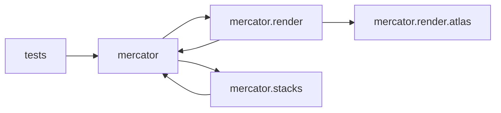

# Mercator — Visual View

**Stack**: python
**Systems**: 5
**Dep edges**: 6
**DMZ rules**: 0
**Violations**: 0

_This file regenerates on every `mercator refresh` or `mercator render`. Do not edit by hand — edit `.mercator/boundaries.json` and rerun. Renders natively in GitHub, VS Code, Obsidian._

## 1. Dependency graph (what currently is)

## 2. DMZ rules

No `.mercator/boundaries.json` configured. Run `mercator boundaries init` to scaffold one.

## How to edit

- **Add / edit DMZ rules**: open `.mercator/boundaries.json` (scaffold with `mercator boundaries init`).
- **Re-render this file**: `mercator render` (also runs automatically on every `mercator refresh`).
- **CI gate**: `mercator check` exits 1 if any `error`-severity rule is violated.

